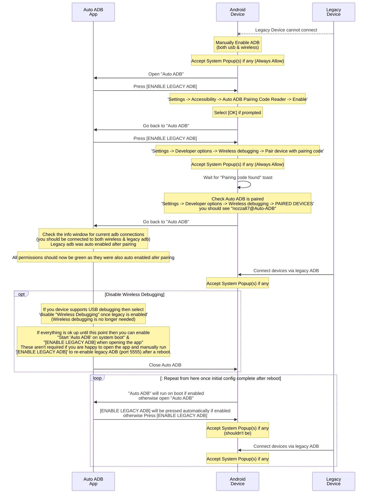

# Auto ADB
An app that enables persistent legacy ADB (port 5555) from within a device without user input.

  

> [!IMPORTANT]
> V2 uses raw code and libraries instead of binaries blobs
>- This allows everything to be open source / transparent / auditable and easily compiled as well as give more fine grained control over the process
>
> V2 would not be possible without some help from others:
>- <a href="https://github.com/MuntashirAkon/libadb-android">MuntashirAkon LibADB Android</a> <-- This is a very useful library including its dependencies and other repos by MuntashirAkon
>- <a href="https://play.google.com/store/apps/details?id=dev.vodik7.tvquickactions">tvQuickActions Pro by tvDev</a> <-- tvDev kindly gave me a hint on how to do on-device pairing  
   >  tvQuickActions is an awesome app and you should check it out (I am not affiliated in any way)
   >
   >  Thanks to some idiot making me not want to share this the source code is not tidied or commented a bit better but here it is, at least it is public now though I guess?
   >  
   >  Please Note:  
   >  I am in no way an Android developer and I pieced this together with ideas from other peoples hard work so please don't be upset at any of the code, it works for me and I am sharing it to hopefully help others, If you can improve it please do so.  
   >  Also feel free to add any suggestions for improvements.

  

## Screenshots

  
&emsp;&emsp;&emsp;  

  

## Download
All apks can be found under releases:
https://github.com/nozza87/Auto_ADB/releases

Otherwise you can compile yourself from source

## Setup Instructions

if at any point you get errors, re-read this and try again or reboot your device and start again from step 1.  
If it still doesn't work then open an issue <a href="https://github.com/nozza87/Auto_ADB/issues">here</a> with as many details and any error messages or logs.

1. On your Android device go to 'Settings -> Developer options' and enable both 'Wireless debugging' and 'USB Debugging'. (if they exist)
   >(select [Always Allow] if prompted on your device)

2. On your Android device open "Auto ADB" and make sure both 'USB Debugging' and 'Wireless Debugging' toggles are on.
   >Check the toggle states (this will confirm everything is working)

3. On your Android device in 'Auto ADB' press '[ENABLE LEGACY ADB]'

4. On your Android device go to 'Settings -> Accessibility -> Auto ADB Pairing Code Reader -> Enable'
   > (select [OK] if prompted on your device)

5. On your Android device go back to 'Auto ADB' press '[ENABLE LEGACY ADB] again'

6. On your Android device go to 'Settings -> Developer options -> Wireless debugging -> Pair device with pairing code'
   > (select [Always Allow] if prompted on your device)

7. On your Android device once you see "Pairing code found" go back to 'Auto ADB' press '[ENABLE LEGACY ADB] again'
   > (You can check you are paired under 'Settings -> Developer options -> Wireless debugging -> PAIRED DEVICES' you should see "nozza87@Auto-ADB")

8. On your Android device while still in 'Auto ADB' check the info window for current adb connections (you should be connected to both wireless & legacy adb)

9. {Optional} If you device support USB debugging then on your Android device in 'Auto ADB' press (or via developer settings) 'disable "Wireless Debugging" once legacy is enabled'
   > (Wireless debugging is no longer needed)

10. If everything is ok up until this point then you can enable "Start 'Auto ADB' on system boot" & "[ENABLE LEGACY ADB] when opening the app"
> These aren't required if you are happy to open the app and manually run '[ENABLE LEGACY ADB]' to re-enable legacy ADB (port 5555) after a reboot.

11. All going well your device should now have legacy ADB running on port 5555 and should automatically re-enable it after a reboot
> You should never need to repeat these steps unless pairing or wireless debugging on your network is revoked

12. Profit?

## Notes

* Since the ADB TLS port is random each time, mDNS discovery is used in order to detect it within the app, if your network blocks this, this tool won't work.

* The 'legacy' mode, which allows unauthorized connections with an on-device prompt, needs to be paired to set up for the first time, so that the embedded ADB client can be allowed to enable the mode by itself in the future.

* ADB Device Fingerprint: 81:66:b5:ee:c8:b3:30:7f:2f:eb:a0:02:67:c1:4f:72 - nozza87@Auto-ADB

* This app was designed and tested for Android TV but should work on other devices.

* The text on the left side of the app will change colour to signal its state:  
  🟩 - Green means this permission / option is in the right state  
  🟨 - Yellow means this permission / option is the wrong state but isn't required  
  🟥 - Red means this permission / option is in thw wrong state

## Flow

